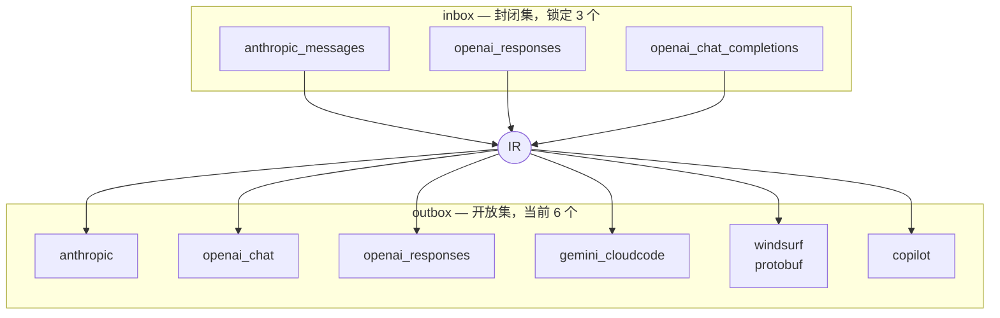
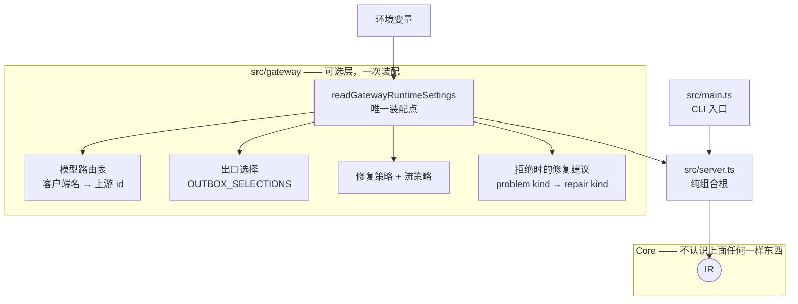

# agent-ir 架构

一句话结论：**入口是封闭集(3)、出口是开放集(3+n),中间只有一个 IR;新增一个上游只付两个函数,换来三条路由。**

边界要分两层说，混为一谈会读错这个仓库：

- **Core**（`src/ir` · `src/ingress` · `src/egress`）只做协议翻译与准入裁决。**不做**账号选择、配额、重试编排、模型映射、任何形式的内容修补 —— 它对「上游是谁、有没有额度、这次该不该重试」一无所知，这是它能保持确定性的前提。
- **参考网关**（`src/gateway` · `src/server.ts`）做上面那些里的一部分：模型名映射、出口选择、修复策略装配、流策略。它是**可选层**，随仓库发布只是为了让 Core 有一个能跑起来的宿主；把 agent-ir 当库用的调用方可以整个不要它，自己拿 Core 的三个 API 拼。

「不做模型映射」说的是 Core，不是这个仓库 —— 见 §6。

---

## 1. 总览：谁连到谁

> 这张图回答：数据从客户端到上游要经过哪几段,以及哪一段是可选的。


关键点：`repair` 是**虚线**——它不在默认路径上。Core 的默认行为是确定性的：表达不了就带精确 IR 路径拒绝，绝不发明内容。

---

## 2. 入口与出口：两条**独立**的轴

> 这张图回答：为什么入口和出口不能用同一套键。



**两条轴独立，不是不相交。** `anthropic` 与 `openai_responses` 恰好两边都在（它们既是客户端协议又是上游 API），但 `gemini_cloudcode` 与 `windsurf` **根本不是任何客户端协议** —— 这就是出口必须以供应商名为键、而不是以 `IRProtocol` 为键的实证。

| | 集合 | 每项要几个函数 | 增长 |
|---|---|---|---|
| inbox | 封闭，3 个 | `readClientRequest` + `writeClientResponse` | 写完永不再长 |
| outbox | 开放，3+n | `writeOutboxRequest` + `readOutboxResponse` | 每加一家付 2 个，换 3 条路由 |

当前路由数 = 3 × 6 = **18**。

### 2.1 命名与所有权约束

`IROutbox` 是出口的唯一公共接口：`writeOutboxRequest` 负责 IR → 供应商 wire，
`readOutboxResponse` 负责供应商 wire → `IREvent`。`IROutboxProfile` 仅声明每个出口都能
共同解释的 wire 事实：`supports`、`lossy`、`mandatory`。

这条边界是强约束，不是命名偏好：不得用 `egress`、`upstream` 或 `provider` 充当新的 Core
方向名；客户端侧使用 `inbox`，供应商 wire 侧使用 `outbox`。外部协议原文字段、错误码和
历史证据可保留原名。

**目录名是唯一的例外，而且是有意保留的**：磁盘上仍然是 `src/ingress/` 与 `src/egress/`。
契约名（`IROutbox` / `writeOutboxRequest` / `IRLoss.stage`）已经全部换成方向名，目录改名
是一次纯路径扰动，收益不抵它在评审里制造的噪音。引用源码位置时照实写路径，不要按新术语
臆造一个 `src/outbox/`。

任何一家 Outbox 的私有逻辑——Windsurf 的 Connect/protobuf、供应商鉴权、内建工具映射、
供应商策略限制——只放在该 Outbox 自己的 `src/egress/` 模块，由自己的 Outbox 实现处理。不要为一家
供应商向 `IROutboxProfile` 添加布尔字段、全局枚举、通用 repair 条目或含糊 callback；只有
至少两家具有相同语义、相同输入输出和相同调用方时，才能抽取新接口，并须同时交付两家实现
与契约测试。

接口命名表达稳定跨模块契约，类仅用于封装具体状态与生命周期；无状态转换使用具名纯函数。
新接口和方法必须在名字中写出领域对象与方向，禁止 `process`、`handle`、`helper`、`manager`
等无法推断输入输出的泛化命名。

---

## 3. 六个上游的真实传输形态

**只有 Windsurf 是二进制。** Gemini CloudCode 常被误认为 protobuf，它其实是 JSON SSE。

| 出口 | 端点 | 请求体 | 响应 |
|---|---|---|---|
| `anthropic` | `/v1/messages` | JSON | SSE(JSON) |
| `openai_chat` | `/v1/chat/completions` | JSON | SSE(JSON) + `[DONE]` |
| `openai_responses` | `/v1/responses` | JSON | SSE(JSON) |
| `gemini_cloudcode` | `v1internal:streamGenerateContent?alt=sse` | JSON | SSE(**CRLF 分帧**) |
| `windsurf` | `/exa.api_server_pb.ApiServerService/GetChatMessage` | **protobuf** | **Connect 二进制帧** |
| `copilot` | `/v1/messages` | JSON | SSE(JSON) |

因此 `IRWireRequest` 对 body 泛型：`IRWireRequest<TBody extends IRWireBody>`（`IRWireBody = string | Uint8Array`）。二进制 wire 保留原始字节，绝不 base64 化。

### 3.1 两个**故意不是** `IROutbox` 的东西

`IROutbox` 这个公共契约只描述「一条能被 fetch 发出去的 POST wire」。有两样真实存在、也确实
在跑的东西不满足这个形状，它们各自住在自己的模块里，**没有**为了收编它们去松动公共契约：

| | 源码 | 为什么不能是 `IROutbox` |
|---|---|---|
| **ChatGPT Codex 私有 Responses** | `src/egress/codex/` | 传输是 WebSocket `response.create` 帧，不是 POST；续轮靠 `previous_response_id`，工具定义放在 `input` 的 `additional_tools` item 里。收编它就得给 Core 加一层只服务它一家的运输抽象 |
| **Windsurf 的 `web_search` 执行器** | `src/egress/windsurf/web_search.ts` | 它不是「把 IR 编译成 wire」，而是**执行一个工具**：`GetChatMessage` 只把 `web_search` 当普通 function tool 发下去，真实客户端在模型返回该调用后另行调 `GetWebSearchResults`，再把结果当普通 `IRToolResult` 回灌。这是宿主工具循环的事，不是协议翻译 |

两者都复用已有件而不是复制语义：codex 把 WebSocket 文本消息里的 JSON payload 直接喂给既有的
Responses event lifter；web_search 的产物是普通 `IRToolResult`，不新增任何 IR 概念。

注意 `webfetch`：真实客户端把它和 `web_search` 一样声明成普通 function tool，但抓包里
**没有它的执行报文**，所以本仓库不实现它 —— 没有证据的东西不写。

两条踩过的坑：
- **CloudCode 用 CRLF 分帧**。按 `indexOf("\n\n")` 找边界会把整条流攒成一个 block，症状不是报错是**内容凭空消失**。正确做法是逐行扫描 + 空行分帧（与官方 SDK 一致）。
- **Windsurf 的应用错误在 Connect 尾帧里，没有 HTTP 状态码**。传输层是 200，`permission_denied` 落进资源重试会打遍账号池、伪装成 503。这条坑本身照旧成立（它说的是**错误往哪放**），但**别把它读成「为什么被拒」** —— 见下。

### 3.1 一条被抓包证伪的说法

此前有一个说法被当成事实四处引用：**「Windsurf 上游的内容分类器会因为 agent 脚手架的体量或
关键词密度拒掉整条请求」**。2026-08-04 从真实 Devin CLI 抓到的 12 条 `GetChatMessage`
**证伪了它**：21KB 的 agent system prompt + 23 个工具 + PNG 图片 + 21 轮历史，**全部 HTTP 200**。
体量与关键词密度不是判据。逐条数据见 [EVIDENCE.md](EVIDENCE.md) 的「Windsurf 真实抓包」一节。

抓包唯一测到的差别是**客户端身份**：真实客户端的 system prompt 第一行是
`You are Devin, an interactive command line agent from Cognition.`

**但抓包只证到这里。** 没有人做过对照实验，因此下面这些都**还没有验证**，不许当结论用：

- 「只替换身份行就够了」—— 无实证。抓包里身份行与其余 21KB 正文是同时出现的，
  分不开哪一部分在起作用，也可能两者都不起作用。
- 「上游根本不看 prompt 内容」—— 同样无实证。12 条全 200 只说明**这 12 条**没被拒，
  证伪不了「存在某种会被拒的输入」。

对 Core 的结论只有一条，而且是消极的：这类猜测**不构成**往 `IROutboxProfile` 加字段的理由。
供应商的内容策略既不是 wire 事实也不是能力声明，`profile` 里没有它的位置（AGENTS.md 接口边界）。

---

## 4. 一次请求的时序

> 这张图回答：一次请求经过哪些裁决点，各点失败时怎么收场。


两个裁决点的分工：**准入**看「这个出口支不支持这类能力」（静态声明），**写出**看「这条具体请求能不能编译成合法 wire」（实际内容）。前者拒得早、代价低；后者拒得准、路径精确到字段。

---

## 5. 响应侧：流与文档

> 这张图回答：为什么响应有两种形态，以及它们怎么闭环回下一轮请求。


**闭环在 `IRResponse.turn`**：它是一个 assistant `IRTurn`，与请求历史里的回合**同一个类型**，可以直接接进下一轮，不必绕一圈 wire 再读回。测试锁死了这条 —— 组装出的回合与走 Anthropic wire 再读回来的结果**完全相等**。

`IREvent` 十一态：`messageStart` / `partStart` / `partDelta` / `partEnd` / `usage` / `messageStop` / `error` / `loss` / `unhandled` / `committed` / `heartbeat`。

后两个由流守卫注入：`committed` 标记首个语义产出已下发（**此后不可换号、不可改状态码**）；`heartbeat` 由计时器驱动，各 encoder 渲染成自己协议的保活帧。

---

## 6. 参考网关：Core 之外那一层

> 这张图回答：`src/gateway/` 到底管什么，以及为什么它不能在 Core 里。

前面五节讲的都是 Core。但 Core 的三个 API（读入 / 裁决 / 写出）单独摆着是跑不起来的 ——
总得有人回答「这条请求发给谁」「客户端说的 `claude-opus-5` 在这家上游叫什么」「哪几条修复是开着的」。
这些问题的共同点是**换一个部署就会有不同答案**，所以按 §8 的判据它们全是策略，一条都不能进 Core。



四件事，各自的判据：

| 网关做的事 | 源码 | 为什么不能进 Core |
|---|---|---|
| **模型名映射** | `model_routing.ts` | 客户端说的 `claude-opus-5` 与上游签发的 id（windsurf 的 `chat_model_uid`、gemini 的档位名）是**两个命名空间**。这张表因部署而异，没有正确的默认值 |
| **出口选择** | `outbox_selection.ts` · `config.ts` | 「这条请求发给谁」取决于持有哪家凭据、哪家还有额度 —— Core 对此一无所知 |
| **修复策略装配** | `config.ts` · `repair/**` | 修不修、修哪几条，是调用方的成本/正确性权衡 |
| **拒绝时给建议** | `repair_advice.ts` | `Record<IRBuildProblemKind, IRRepairKind[]>` —— 新增一种拒绝理由时编译器逼你回答「这条能不能修」 |

两条贯穿设计：

- **构造成功即可用**。`readGatewayRuntimeSettings` 返回之后不存在「还没校验」的字段：出口已绑好、模型表已解析、修复种类已核对。所有会失败的判断都发生在启动时，不散在第一条请求的路径上 —— 配错了就起不来，而不是跑到半夜才 4xx。
- **不中默认拒绝，不默认透传**。模型表查不到时默认 `refuse`，因为默认透传等于「配不配都能跑」，那就没人会配它；而配错的人拿到的是上游的 opaque 4xx，指不回网关这边。想透传的人显式写 `AGENT_IR_MODEL_FALLBACK=passthrough` —— 那是一个决定，决定就该写下来。

**把 agent-ir 当库用的调用方可以整个不要这一层**：Core 从 `src/index.ts` 导出，自己拿三个 API 拼一个宿主即可。`src/main.ts` 与 `src/server.ts` 拆开也是为此 —— 宿主可以注册完 IRMessage interceptor 再 `startGateway()`。

---

## 7. 节点到源码

目录名沿用 `ingress`/`egress`（见 §2.1 末尾），契约名一律是 `inbox`/`outbox`。下表左列是概念，
右列是磁盘上的真实路径，两者不必同名。

| 图上的东西 | 源码 |
|---|---|
| IR 类型契约（L0/L1/L2）、`IROutbox` 公共接口 | `src/ir/types.ts` |
| 两条轴的注册表（`OUTBOX_REGISTRY`） | `src/protocols.ts`、`src/ir/codec.ts` |
| 准入裁决 | `src/ir/admission.ts` |
| 能力需求推导 | `src/ir/capabilities.ts` |
| 响应折叠 | `src/ir/response.ts` |
| 流守卫（提交点/保活/退避） | `src/ir/stream_guard.ts` |
| SSE 分帧 | `src/ir/sse.ts` |
| IRMessage 审计 interceptor chain | `src/ir/ir_message_interception_extensions.ts` |
| 三个 Inbox codec | `src/ingress/**` |
| 六个 Outbox（`OUTBOX_REGISTRY`） | `src/egress/**`（windsurf 在子目录，唯一带依赖） |
| Codex WebSocket 适配（**不是** `IROutbox`，见 §3.1） | `src/egress/codex/` |
| Windsurf `web_search` 执行器（**不是** `IROutbox`，见 §3.1） | `src/egress/windsurf/web_search.ts` |
| Windsurf 真实报文夹具（12 条，全部 200） | `test/fixtures/windsurf_capture/` |
| 出口选择（`OUTBOX_SELECTIONS`） | `src/gateway/outbox_selection.ts` |
| 网关唯一装配点（`readGatewayRuntimeSettings`） | `src/gateway/config.ts` |
| repair（可选层） | `src/repair/**` |
| 参考网关（可选层） | `src/gateway/**`、`src/server.ts` |
| CLI 入口 | `src/main.ts` |
| 公共入口 | `src/index.ts` |

---

## 8. 契约与判据

**Core 的唯一承诺：编译或拒绝。**

```ts
interface IROutbox<TBody extends IRWireBody = string> {
  readonly profile: IROutboxProfile;
  writeOutboxRequest(request: IRRequest): Promise<OutboxRequestBuildResult<TBody>>;
  readOutboxResponse(response: Response, options?): AsyncIterable<IREvent>;
}

type OutboxRequestBuildResult<TBody> =
  | { ok: true;  wire: IRWireRequest<TBody>; losses: readonly IRLoss[] }
  | { ok: false; problems: readonly IRBuildProblem[]; losses: readonly IRLoss[] }
```

判别联合而不是抛异常：**失败是正常返回值之一，调用方必须表态。**
两个分支都带 `losses` —— 拒绝之前已经攒下的留痕一并交出，不因为拒绝就丢掉。

留痕本身也带方向：`IRLoss.stage` 的三个取值是 `inbox` / `outbox` / `lift`，
`IRLoss.outbox` 记下是哪一家出口产生的（inbox 阶段为 `null`）。

划线判据 —— 遇到「目标承载不了」时怎么办：

| | 归属 | 例子 |
|---|---|---|
| 目标 wire 真的没有这个位置 | **编译事实**，留 Core，记 `IRLoss` 或拒绝 | 分组拍进名字、effort 夹进枚举区间 |
| 我替你决定怎么办 | **策略**，归 repair，调用方显式挂 | 悬空调用补占位、必填字段补默认值、图片降级成文本 |

拿不准时的标准问法：**「这个决定换一个调用方会不会想要不同的结果？」** 会 → 策略；不会 → 编译事实。

**`supports` 只收行为实证**（生产真跑过、上游按预期行事）。结构实证（协议定义里有字段，但没有任何一次真实调用证明上游会照它行事）只能进 `lossy`。

---

## 9. 反模式

- **把 wire 格式当 IR**。位置不变量（`tool_result` 必须紧邻）是 wire 层的事，混进 IR 会让每个入口各维护一套排列规则。
- **用索引签名夹带未知字段**。新增出口时它们会静默蒸发；未知必须显式装箱成 `opaque`，让类型系统逼每个出口表态。
- **在 `readOutboxResponse` 的 switch 里留缺省黑洞**。没匹配上的事件必须产出 `unhandled` —— 实测代价是一天 126 次静默 `context_length_exceeded`，调用方只能盲重试。
- **把保活挂在数据分支上**。上游彻底静默正是保活唯一要顶的场景，数据驱动会让它恰好在那时停摆。
- **Core 里发明内容**。同一个 IR 换个出口出来的对话多了一句网关编的话，确定性就没了。
