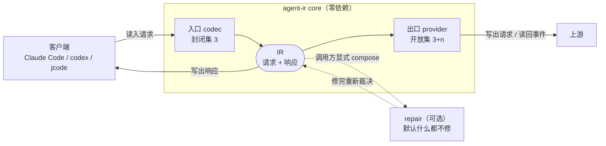
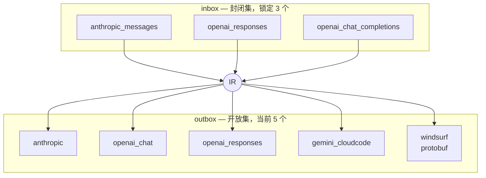
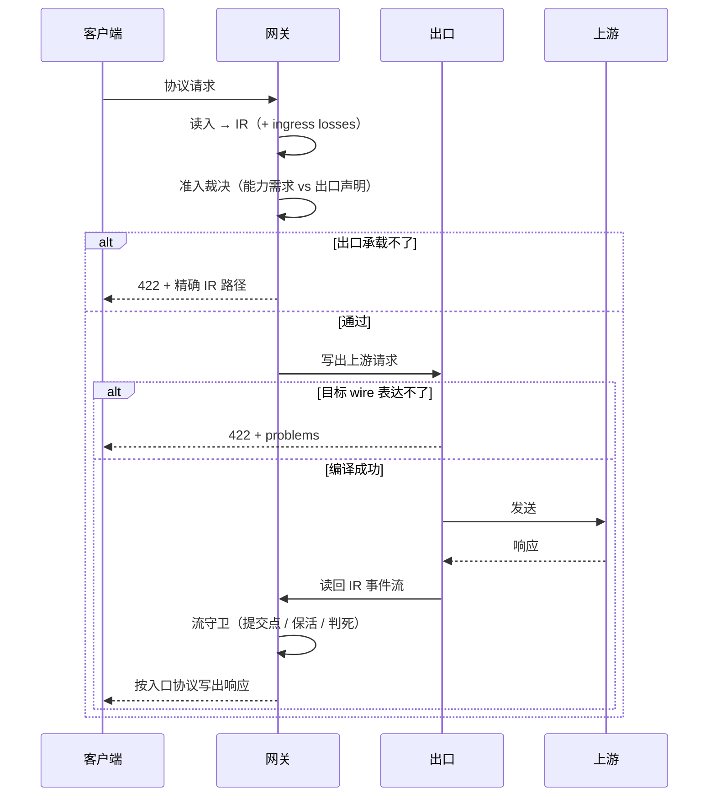
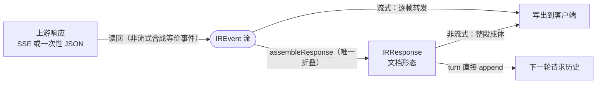

# agent-ir 架构

一句话结论：**入口是封闭集(3)、出口是开放集(3+n),中间只有一个 IR;新增一个上游只付两个函数,换来三条路由。**

边界：agent-ir 只做协议翻译与准入裁决。**不做**账号选择、配额、重试编排、模型映射 —— 那些是调用方(网关)的事。

---

## 1. 总览：谁连到谁

> 这张图回答：数据从客户端到上游要经过哪几段,以及哪一段是可选的。



关键点：`repair` 是**虚线**——它不在默认路径上。Core 的默认行为是确定性的：表达不了就带精确 IR 路径拒绝，绝不发明内容。

---

## 2. 入口与出口：两条**独立**的轴

> 这张图回答：为什么入口和出口不能用同一套键。



**两条轴独立，不是不相交。** `anthropic` 与 `openai_responses` 恰好两边都在（它们既是客户端协议又是上游 API），但 `gemini_cloudcode` 与 `windsurf` **根本不是任何客户端协议** —— 这就是出口必须以供应商名为键、而不是以 `IRProtocol` 为键的实证。

| | 集合 | 每项要几个函数 | 增长 |
|---|---|---|---|
| inbox | 封闭，3 个 | `readClientRequest` + `writeClientResponse` | 写完永不再长 |
| outbox | 开放，3+n | `writeUpstreamRequest` + `readUpstreamResponse` | 每加一家付 2 个，换 3 条路由 |

当前路由数 = 3 × 5 = **15**。

---

## 3. 五个上游的真实传输形态

**只有 Windsurf 是二进制。** Gemini CloudCode 常被误认为 protobuf，它其实是 JSON SSE。

| 出口 | 端点 | 请求体 | 响应 |
|---|---|---|---|
| `anthropic` | `/v1/messages` | JSON | SSE(JSON) |
| `openai_chat` | `/v1/chat/completions` | JSON | SSE(JSON) + `[DONE]` |
| `openai_responses` | `/v1/responses` | JSON | SSE(JSON) |
| `gemini_cloudcode` | `v1internal:streamGenerateContent?alt=sse` | JSON | SSE(**CRLF 分帧**) |
| `windsurf` | `/exa.api_server_pb.ApiServerService/GetChatMessage` | **protobuf** | **Connect 二进制帧** |

因此 `IRWireRequest` 对 body 泛型：`IRWireRequest<TBody extends string | Uint8Array>`。二进制 wire 保留原始字节，绝不 base64 化。

两条踩过的坑：
- **CloudCode 用 CRLF 分帧**。按 `indexOf("\n\n")` 找边界会把整条流攒成一个 block，症状不是报错是**内容凭空消失**。正确做法是逐行扫描 + 空行分帧（与官方 SDK 一致）。
- **Windsurf 的应用错误在 Connect 尾帧里，没有 HTTP 状态码**。传输层是 200，`permission_denied` 落进资源重试会打遍账号池、伪装成 503。

---

## 4. 一次请求的时序

> 这张图回答：一次请求经过哪些裁决点，各点失败时怎么收场。



两个裁决点的分工：**准入**看「这个出口支不支持这类能力」（静态声明），**写出**看「这条具体请求能不能编译成合法 wire」（实际内容）。前者拒得早、代价低；后者拒得准、路径精确到字段。

---

## 5. 响应侧：流与文档

> 这张图回答：为什么响应有两种形态，以及它们怎么闭环回下一轮请求。



**闭环在 `IRResponse.turn`**：它是一个 assistant `IRTurn`，与请求历史里的回合**同一个类型**，可以直接接进下一轮，不必绕一圈 wire 再读回。测试锁死了这条 —— 组装出的回合与走 Anthropic wire 再读回来的结果**完全相等**。

`IREvent` 十一态：`messageStart` / `partStart` / `partDelta` / `partEnd` / `usage` / `messageStop` / `error` / `loss` / `unhandled` / `committed` / `heartbeat`。

后两个由流守卫注入：`committed` 标记首个语义产出已下发（**此后不可换号、不可改状态码**）；`heartbeat` 由计时器驱动，各 encoder 渲染成自己协议的保活帧。

---

## 6. 节点到源码

| 图上的东西 | 源码 |
|---|---|
| IR 类型契约（L0/L1/L2） | `src/ir/types.ts` |
| 两条轴的注册表 | `src/protocols.ts`、`src/ir/codec.ts` |
| 准入裁决 | `src/ir/admission.ts` |
| 能力需求推导 | `src/ir/capabilities.ts` |
| 响应折叠 | `src/ir/response.ts` |
| 流守卫（提交点/保活/退避） | `src/ir/stream_guard.ts` |
| SSE 分帧 | `src/ir/sse.ts` |
| 三个入口 codec | `src/ingress/**` |
| 五个出口 | `src/egress/**`（windsurf 在子目录，唯一带依赖） |
| repair（可选层） | `src/repair/**` |
| 公共入口 | `src/index.ts` |

---

## 7. 契约与判据

**Core 的唯一承诺：编译或拒绝。**

```ts
writeUpstreamRequest(request): Promise<
  | { ok: true;  wire: IRWireRequest<TBody>; losses: readonly IRLoss[] }
  | { ok: false; problems: readonly IRBuildProblem[]; losses: readonly IRLoss[] }
>
```

判别联合而不是抛异常：**失败是正常返回值之一，调用方必须表态。**

划线判据 —— 遇到「目标承载不了」时怎么办：

| | 归属 | 例子 |
|---|---|---|
| 目标 wire 真的没有这个位置 | **编译事实**，留 Core，记 `IRLoss` 或拒绝 | 分组拍进名字、effort 夹进枚举区间 |
| 我替你决定怎么办 | **策略**，归 repair，调用方显式挂 | 悬空调用补占位、必填字段补默认值、图片降级成文本 |

拿不准时的标准问法：**「这个决定换一个调用方会不会想要不同的结果？」** 会 → 策略；不会 → 编译事实。

**`supports` 只收行为实证**（生产真跑过、上游按预期行事）。结构实证（协议定义里有字段，但没有任何一次真实调用证明上游会照它行事）只能进 `lossy`。

---

## 8. 反模式

- **把 wire 格式当 IR**。位置不变量（`tool_result` 必须紧邻）是 wire 层的事，混进 IR 会让每个入口各维护一套排列规则。
- **用索引签名夹带未知字段**。新增出口时它们会静默蒸发；未知必须显式装箱成 `opaque`，让类型系统逼每个出口表态。
- **在 `readUpstreamResponse` 的 switch 里留缺省黑洞**。没匹配上的事件必须产出 `unhandled` —— 实测代价是一天 126 次静默 `context_length_exceeded`，调用方只能盲重试。
- **把保活挂在数据分支上**。上游彻底静默正是保活唯一要顶的场景，数据驱动会让它恰好在那时停摆。
- **Core 里发明内容**。同一个 IR 换个出口出来的对话多了一句网关编的话，确定性就没了。
